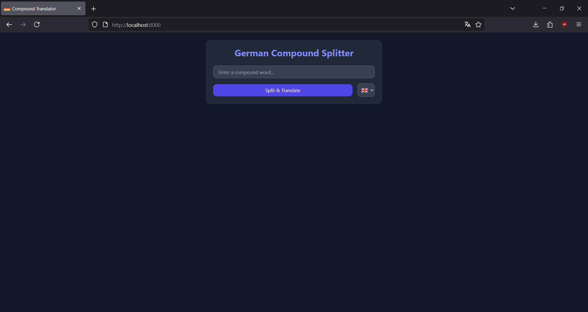
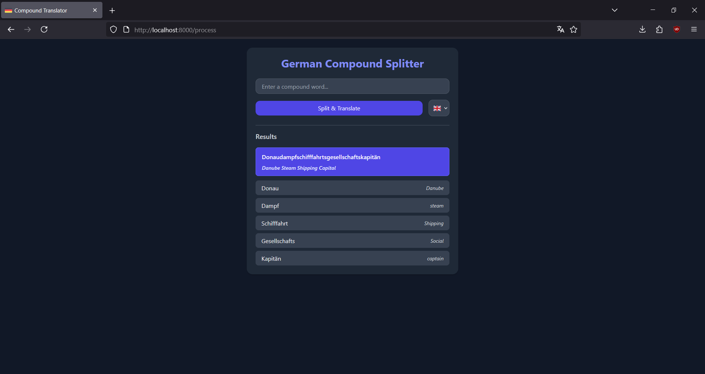

# compound-translator

A web-based app, that splits compound German nouns and translates them automatically _**(with no LLMs involved)**_


---

## Installation (development)

```bash
git clone https://github.com/kamix-08/compound-translator.git
cd compound-translator
```

```bash
python -m venv .venv
source .venv/bin/activate # or .venv\Scripts\activate on Windows
```

```bash
pip install -r requirements.txt
uvicorn app.main:app --reload
```

Then visit [localhost:8000](https://localhost:8000) in your browser.

## Installation (docker)

```bash
docker run -d -p 8080:80 -v ./data:/build/data ghcr.io/kamix-08/compound-translator
```
### Installation with Docker Compose

Copy the `docker-compose.yml` file to an empty directory, then run:

```bash
docker-compose up -d
```

Then visit [localhost:8080](https://localhost:8080) in your browser.

## Gallery





## Credits

- compound splitting via [`german_compound_splitter`](https://github.com/repodiac/german_compound_splitter)
- dictionary sourced from [SourceForge](https://sourceforge.net/projects/germandict)
- favicon comes from [Flaticon](https://flaticon.com)